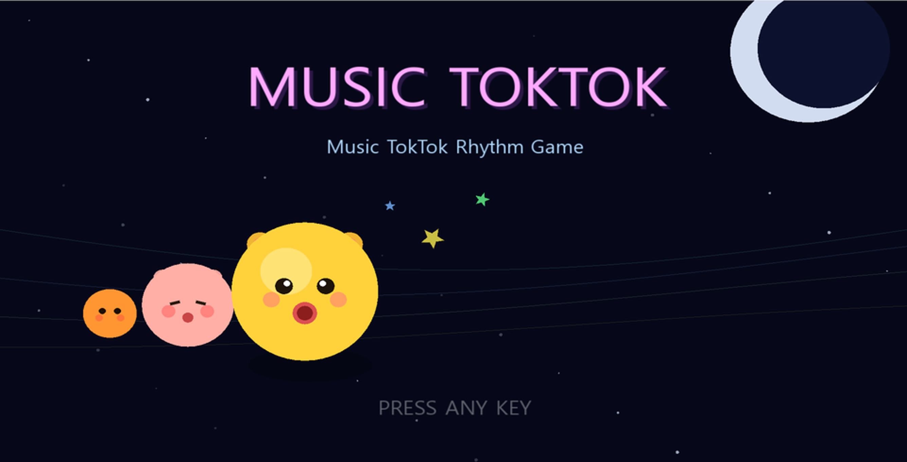
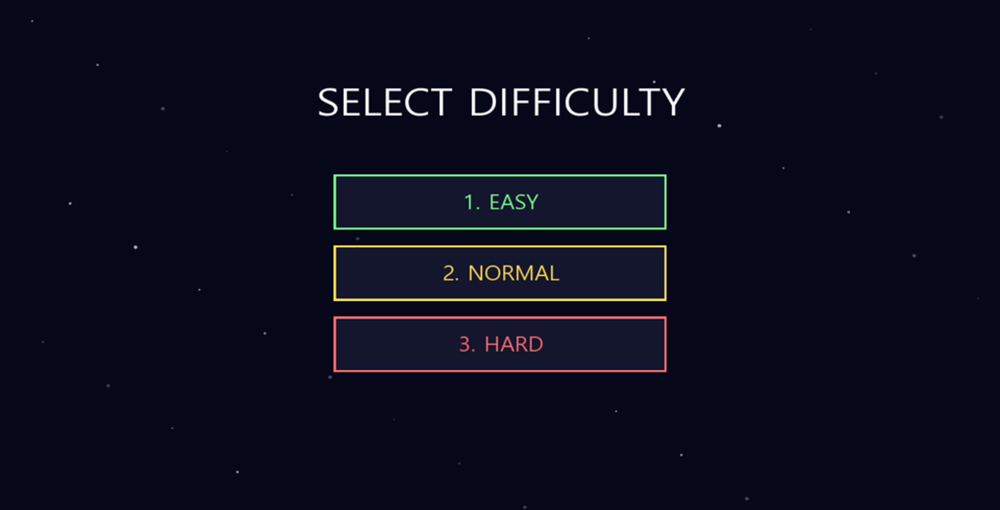
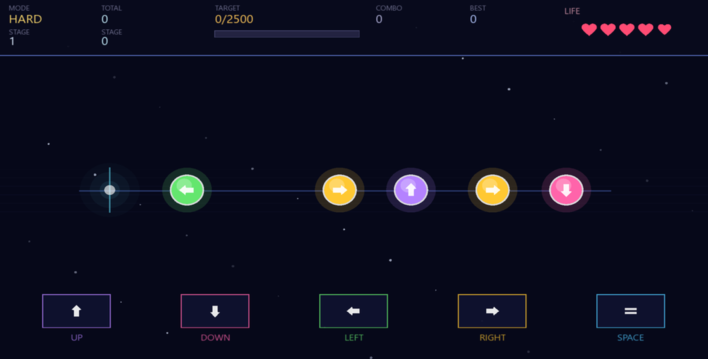
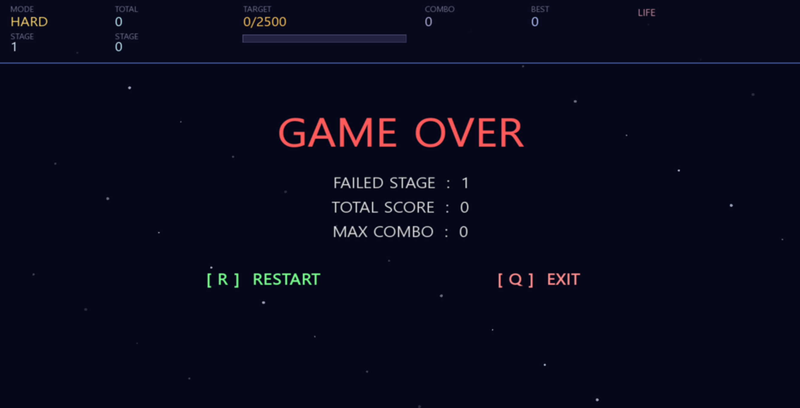

# 🎵 Rhythm Game Project


C++와 SFML을 활용하여 구현한 리듬 게임 및 미니게임 프로젝트입니다.

---

## 📌 프로젝트 소개
본 프로젝트는 C++와 SFML을 활용하여 구현한 리듬 게임 및 단계별 게임 흐름 프로젝트입니다.

리듬 판정 시스템, 난이도 선택, 키 입력 처리, 점수 및 콤보 계산 기능 등을 구현했으며,  
음악 타이밍에 맞춰 노트 판정이 이루어지도록 게임 로직을 구성했습니다.

또한 팀원들과 단계별 게임을 연결하여 하나의 게임 흐름으로 이어지도록 구성했습니다.

---

## 📅 프로젝트 정보
- 개발 기간: 2026.03.30 ~ 2026.04.03
- 개발 형태: 팀 프로젝트
- 개발 언어: C++
- 개발 환경: Visual Studio

---

## 🛠 기술 스택

| 구분 | 내용 |
|------|------|
| Language | C++ |
| Library | SFML |
| IDE | Visual Studio |

---

## 💡 주요 기능

### 🎮 리듬 게임 기능
- 방향키 기반 리듬 입력 및 판정 처리
- PERFECT / GOOD / MISS 판정 시스템
- 점수 및 콤보 계산 시스템
- 음악 타이밍 기반 노트 처리 로직 구현

### 🎚 난이도 및 판정 기능
- Easy / Normal / Hard 난이도 선택 기능 구현
- 난이도별 노트 속도 및 생성 수 차이 적용
- 난이도별 판정 범위 및 게임 진행 구성
- 단계별 입력 타이밍 기준 처리 로직 구현
- 생명(HP) 기반 게임 오버 처리 기능 구현

### 🕹 게임 시스템
- 미니게임 스테이지 구성
- 단계별 게임 흐름 연결
- 게임 오버 및 결과 화면 출력 기능

---

## 👨‍💻 구현 내용
- SFML 기반 게임 화면 및 입력 처리 구현
- 키 입력 기반 리듬 판정 로직 구현
- 점수, 콤보 및 생명(HP) 기반 게임 상태 처리 구현
- 난이도별 노트 속도 및 판정 범위 처리 구현
- 단계별 노트 생성 및 입력 타이밍 처리 로직 구현
- 콤보 유지 및 MISS 기반 점수 처리 로직 구현

---

## ⚙️ 문제 해결 경험

### 🎵 음악과 노트 타이밍 불일치 문제
- 음악 재생 타이밍과 노트 판정 타이밍이 어긋나는 문제가 발생
- 입력 판정 기준 및 노트 생성 타이밍을 조정하여 싱크 문제 해결

### 🎮 판정 처리 오차 문제
- 입력 타이밍에 따라 판정 결과가 불안정하게 처리되는 문제가 발생
- PERFECT / GOOD / MISS 기준 범위를 조정하여 판정 안정성 확보

### 🖥 게임 흐름 전환 문제
- 단계별 게임 전환 과정에서 화면 상태가 정상적으로 유지되지 않는 문제가 발생
- 게임 상태값 기반 흐름 제어를 통해 화면 전환 구조 개선

---

## 🧠 설계 포인트
- 음악 타이밍 기반 입력 판정 구조 설계
- 게임 상태값 기반 화면 흐름 처리
- 난이도별 판정 및 게임 진행 로직 구성
- 단계별 게임 흐름 기반 화면 전환 구조 구성

---

## 🚀 프로젝트 특징
- 리듬 판정 시스템 직접 구현
- 음악 타이밍 기반 노트 처리 로직 구현
- 난이도별 노트 속도, 판정 범위 및 노트 수 처리 구현
- 단계별 게임 흐름 기반 화면 전환 구조 구현

---

## 📁 프로젝트 구조

```text
rhythm-game-project/

├── src/                         # C++ SFML 소스 코드
│   ├── main.cpp
│   └── MusicTokTok.cpp
│
├── images/                      # README 실행 화면 이미지
│   ├── main.png
│   ├── difficulty.png
│   ├── gameplay.png
│   └── gameover.png
│
├── docs/                        # 발표 자료
│   └── rhythm_game_presentation.pdf
│
├── MusicTokTok.vcxproj
├── MusicTokTok.vcxproj.filters
├── MusicTokTok.slnx
├── .gitignore
└── README.md
```

---

## 🙋 담당 역할
- SFML 기반 리듬 게임 화면 및 입력 처리 구현
- 키 입력 기반 리듬 판정 로직 구현
- 점수 및 콤보 계산 시스템 구현
- 난이도 선택 및 게임 상태 처리 구현
- 음악 타이밍 기반 노트 판정 로직 조정
- 게임 오버 및 결과 화면 구성

---

## 📈 구현 결과 및 효과
- 음악과 입력 타이밍 기반 리듬 게임 시스템 구현
- 점수 및 콤보 기반 게임 플레이 구조 구현
- 단계별 미니게임 연결 기반 게임 흐름 구성
- 사용자 입력에 따른 실시간 판정 처리 구현

---

## 🎥 시연 영상
시연 영상은 추후 업로드 예정입니다.

---

## 📑 발표 자료
- [발표자료 보기](docs/rhythm_game_presentation.pdf)

---

## 📷 실행 화면

### 🎵 메인 화면


---

### 🎚 난이도 선택 화면


---

### 🎮 플레이 화면


---

### 💀 게임 오버 화면

